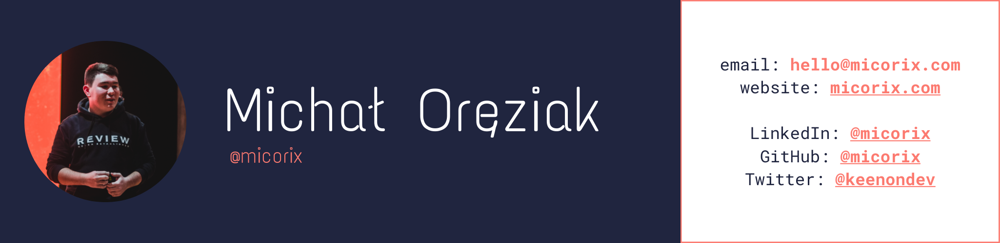

  
  <a href="https://twitter.com/keenondev">Twitter</a> •
  <a href="https://linkedin.com/in/micorix">LinkedIn</a> •
  <a href="https://micorix.com">Website</a> •
  <a href="mailto:hello@micorix.com">Send me an email</a>

# Hi there!

My name is Michał Oręziak and I'm 🇵🇱  17 y/o frontend developer passionated about open-source. 

## Major projects

### WarsawLO 🏫

WarsawLO is the simplest and the fastest search engine for Warsaw high schools.

We're currently build the app as open-source project under the auspices of [ePaństwo Foundation](https://epf.org.pl).

 

### Hack Club Warsaw 🤖

I'm the leader of [Hack Club Warsaw community](https://hackclub.pl). 

## My stack 💻

I do mostly React & Gatsby stuff. (Experimenting with Vue, Svelte).

