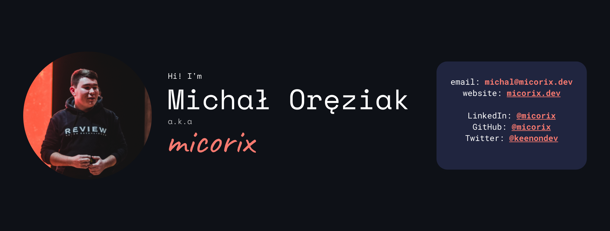

[Twitter](https://twitter.com/keenondev) •
[LinkedIn](https://linkedin.com/in/micorix) •
[Website](https://micorix.com) •
[Send me an email](mailto:hello@micorix.com)

# Hi there!

My name is Michał Oręziak and I'm 🇵🇱  18 y/o frontend developer and open-source enthusiast. 

## Major projects

### WarsawLO 🏫

WarsawLO is the simplest and the fastest search engine for Warsaw high schools.

We build the app as open-source project under the auspices of [ePaństwo Foundation](https://epf.org.pl).

 

### Hack Club Warsaw 🤖

I'm the leader of [Hack Club Warsaw community](https://hackclub.pl). 

## My stack 💻

I do mostly React & Gatsby stuff. (Experimenting with Vue, Svelte).

